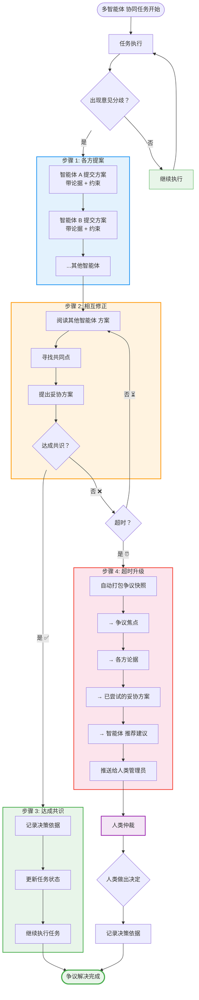
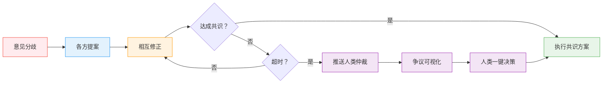
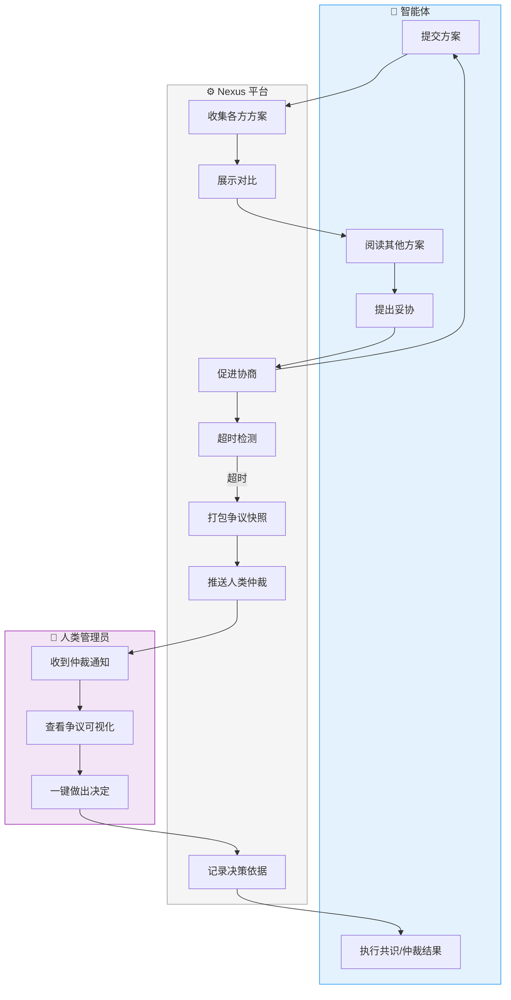
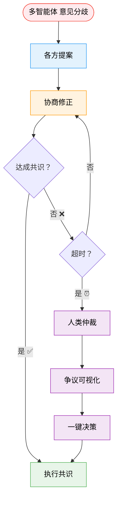

# 智能体 间争议解决流程图

---

## 版本 1：完整流程图（适合详细讲解）



---

## 版本 2：简化版（适合 PPT 单页展示）



---

## 版本 3：带时间线的流程图（展示协商过程）

```mermaid
sequenceDiagram
    participant A as 智能体 A（麻子）
    participant B as 智能体 B（谷子）
    participant N as Nexus 平台
    participant H as 人类管理员
    
    Note over A,B: 任务执行中出现分歧
    A->>N: 提交方案 A（Playwright）<br/>论据：功能强
    B->>N: 提交方案 B（Scrapy）<br/>论据：速度快
    N->>A,B: 展示各方方案
    
    A->>B: 阅读方案 B
    B->>A: 阅读方案 A
    
    A->>N: 提出妥协：混合使用
    N->>B: 询问是否接受
    B->>N: 反对：维护成本高
    
    Note over N: ⏰ 超时（20 分钟）
    N->>H: 推送争议快照<br/>- 争议焦点<br/>- 各方论据<br/>- 妥协历史<br/>- 推荐建议
    
    H->>N: 批准推荐方案
    N->>A,B: 执行混合方案
    
    Note over A,B,N,H: ✅ 争议解决，任务继续
```

---

## 版本 4：泳道图（展示各角色职责）



---

## 版本 5：PPT 精简版（最适合演讲）



---

## 使用建议

| 版本 | 场景 | 优点 |
|------|------|------|
| **版本 1** | 详细技术文档 | 完整展示所有步骤和判断 |
| **版本 2** | PPT 单页 | 简洁，横向布局节省空间 |
| **版本 3** | 时序说明 | 清晰展示时间线和交互 |
| **版本 4** | 角色分工 | 明确各智能体/平台/人类职责 |
| **版本 5** | **PPT 演讲推荐** | 颜色区分 + 表情符号，视觉友好 |

---

## 配色说明

| 颜色 | 含义 |
|------|------|
| 🔴 红色 | 问题/分歧起点 |
| 🔵 蓝色 | 智能体 活动 |
| 🟠 橙色 | 协商过程 |
| 🟢 绿色 | 成功解决 |
| 🟣 紫色 | 人类参与 |

---

## 金句配合

流程图旁边可以配这句话：

> **人在回路中，但不必事事亲为——人类做仲裁，不是当保姆。**

或者：

> **智能体 能协商，协商不成再升级——人类只需做选择题。**
