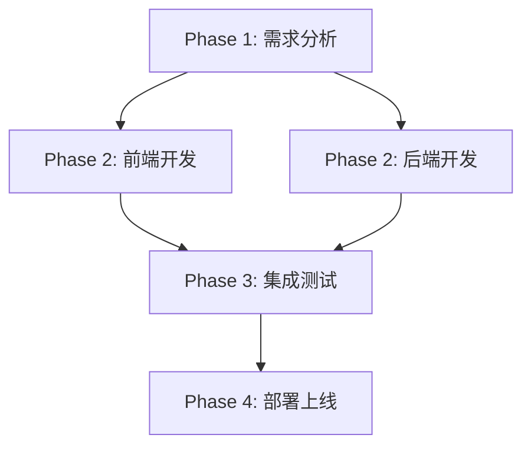

# Sprint 55 需求分析文档 - DAG 流程配置验证项目

## 1. 项目概述

Sprint 55 的目标是验证 Nexus 项目的 DAG（有向无环图）工作流配置能力。该项目旨在实现一个基于 DAG 的任务调度系统，允许任务按照预定义的依赖关系自动执行。项目包含 5 个阶段的任务，通过 DAG 定义它们之间的先后顺序和依赖关系，以验证系统的完整性和可靠性。

## 2. 任务输入输出定义

### Phase 1: 需求分析
- **输入**: 项目目标描述、DAG 工作流概念、Nexus 项目架构
- **输出**: 需求规格说明书、DAG 依赖关系定义、任务划分方案

### Phase 2: 前端开发
- **输入**: 需求规格说明书、UI/UX 设计稿、API 接口规范
- **输出**: 前端页面组件、用户交互界面、前端业务逻辑代码

### Phase 2: 后端开发
- **输入**: 需求规格说明书、数据库设计、API 接口规范
- **输出**: 后端服务接口、业务逻辑处理、数据库操作模块

### Phase 3: 集成测试
- **输入**: 前端代码、后端代码、API 接口规范、测试用例
- **输出**: 集成测试报告、缺陷列表、性能测试结果

### Phase 4: 部署上线
- **输入**: 前后端代码、测试报告、部署配置文件
- **输出**: 生产环境部署包、部署文档、运维监控配置

## 3. DAG 依赖关系图

## 4. 任务验收标准

### Phase 1: 需求分析
- [ ] 完成详细的需求规格说明书
- [ ] 明确定义所有任务间的依赖关系
- [ ] 制定清晰的任务划分方案
- [ ] 评审通过并获得相关方确认

### Phase 2: 前端开发
- [ ] 实现所有必需的前端页面和组件
- [ ] 用户界面符合设计稿要求
- [ ] 与后端 API 接口联调成功
- [ ] 单元测试覆盖率达到 80% 以上

### Phase 2: 后端开发
- [ ] 实现所有必需的 API 接口
- [ ] 业务逻辑处理正确无误
- [ ] 数据库设计与操作符合规范
- [ ] 单元测试覆盖率达到 80% 以上

### Phase 3: 集成测试
- [ ] 前后端集成测试通过
- [ ] 所有功能点验证完毕
- [ ] 性能指标达到预期要求
- [ ] 缺陷修复率达到 95% 以上

### Phase 4: 部署上线
- [ ] 应用成功部署至生产环境
- [ ] 系统稳定运行无明显错误
- [ ] 监控系统正常工作
- [ ] 运维文档齐全

## 5. 并行/串行说明

- **串行执行**:
  - Phase 1 (需求分析) -> Phase 3 (集成测试) -> Phase 4 (部署上线) 需要严格按照顺序执行
  - 每个阶段完成后才能启动下一阶段

- **并行执行**:
  - Phase 2 中的前端开发和后端开发可以并行进行
  - 两个任务都依赖 Phase 1 的输出，但彼此之间无依赖关系
  - 并行开发可提高效率，缩短整体项目周期

此 DAG 结构确保了项目各阶段的合理依赖关系，在保证质量的前提下最大化开发效率。